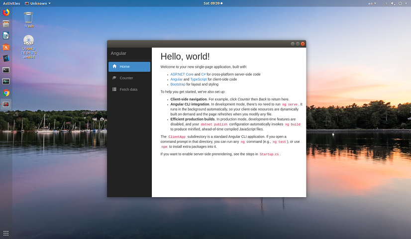
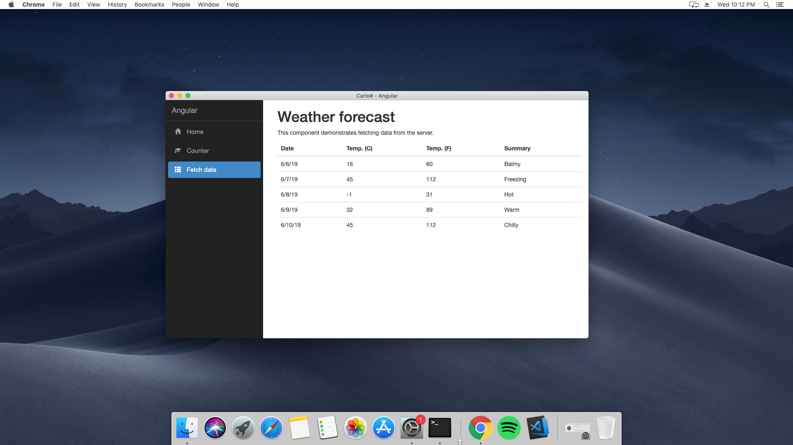
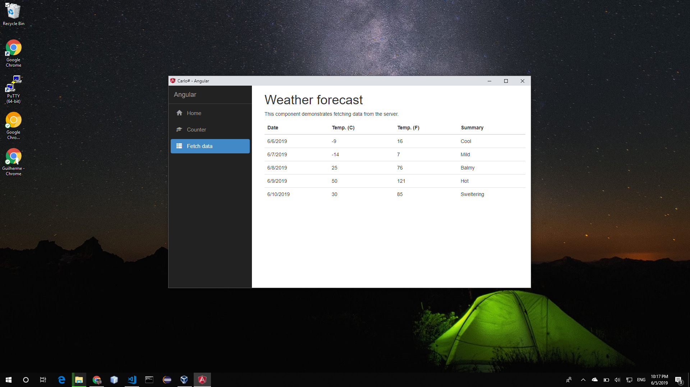

# Carlo# #

Web rendering surface for .NET applications.

This is a port of the Google Carlo project (<https://github.com/GoogleChromeLabs/carlo>) to .NET

## Nuget package

Nuget page: <https://www.nuget.org/packages/CarloSharp/1.0.7>

Adding the package using Package Manager:

> Install-Package CarloSharp -Version 1.0.7

Adding the package using .Net CLI:

> dotnet add package CarloSharp --version 1.0.7

## Requirements ##

.NET Core SDK 2.1+ (<https://www.microsoft.com/net/learn/get-started/windows>)

Google Chrome 74+ (If chrome is not already installed, Carlo# will download Chromium when Channel "*" is selected)

For the Angular and React samples Node JS (<https://nodejs.org/en/)> is also required.

## Building and running the Angular sample ##

To run the Angular sample application you must first restore the Angular NPM dependencies.

Open a terminal at **Samples/Angular/wwwroot** and execute:
`npm install`

After this step you can build and run the project using:
`dotnet run`





```cs

using CarloSharp.Samples.Angular.Controllers;
using System;
using System.Threading;

namespace CarloSharp.Samples.Angular
{
    public class Program
    {
        private static ManualResetEvent _exitEvent = new ManualResetEvent(false);

        public static void Main(string[] args)
        {
            var app = Carlo.Launch(new Options()
            {
                Title = "Carlo# - Angular",
                Width = 1024,
                Height = 600,
                Channel = new string[] { "stable" }
            });

            var controller = new WeatherForecastController(app.MainWindow);

            app.ServeFolder("./wwwroot/dist");

            app.Load("index.html");

            app.Exit += OnAppExit;

            _exitEvent.WaitOne();
        }

        private static void OnAppExit(object sender, EventArgs args)
        {
            _exitEvent.Set();
        }
    }
}
```

```cs
using CarloSharp.Samples.Angular.Model;
using System;
using System.Linq;

namespace CarloSharp.Samples.Angular.Controllers
{
    public class WeatherForecastController
    {
        class WeatherForecastArgs
        {
            public string City { get; set; }

            public bool UseCelsius { get; set; }
        }

        private static string[] Summaries = new[]
        {
            "Freezing", "Bracing", "Chilly", "Cool", "Mild", "Warm", "Balmy", "Hot", "Sweltering", "Scorching"
        };

        public WeatherForecastController(Window window)
        {
            window.IpcMessageReceived += OnIpcMessageReceived;
        }

        private void OnIpcMessageReceived(object sender, IpcMessageEventArgs e)
        {
            if (e.Channel == "getWeatherForecasts")
            {
                var args = e.Message.ToObject<WeatherForecastArgs>();

                e.Result = GetWeatherForecasts(args.City, args.UseCelsius);
            }
        }

        private WeatherForecast[] GetWeatherForecasts(string city, bool useCelsius)
        {
            var random = new Random();

            return Enumerable.Range(1, 5).Select(index =>
                new WeatherForecast
                {
                    DateFormatted = DateTime.Now.AddDays(index).ToString("d"),
                    TemperatureC = random.Next(-20, 55),
                    Summary = Summaries[random.Next(Summaries.Length)]
                }).ToArray();
        }
    }
}
```

```typescript
import { Component } from '@angular/core';

interface Ipc {
  sendSync(channel : string, message : any) : any;
}

declare global {
  interface Window { ipc: Ipc; }
}

@Component({
  selector: 'app-fetch-data',
  templateUrl: './fetch-data.component.html'
})
export class FetchDataComponent {
  public forecasts: WeatherForecast[];

  constructor() {
    this.loadAsync();
  }

  async loadAsync() {
    this.forecasts = await window.ipc.sendSync('getWeatherForecasts', { City: 'New York', UseCelsius: true });
  }
}

interface WeatherForecast {
  dateFormatted: string;
  temperatureC: number;
  temperatureF: number;
  summary: string;
}
```
