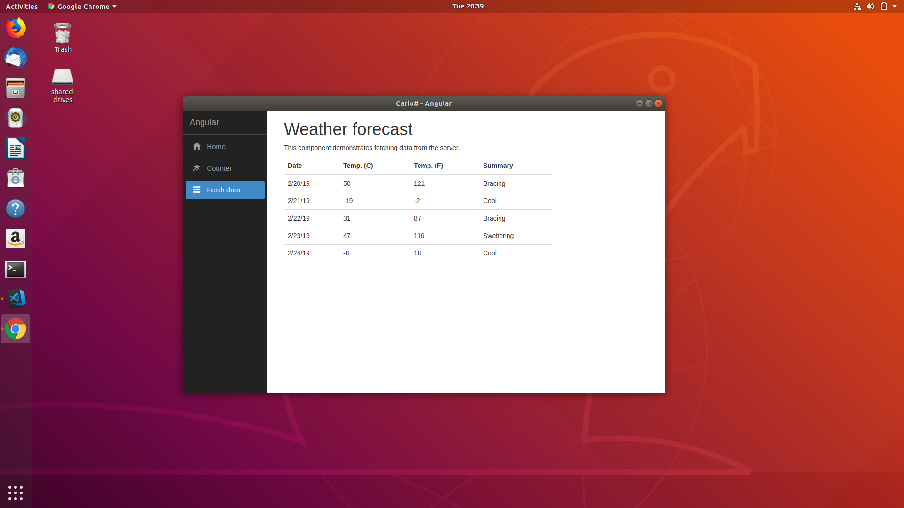

# Carlo# #

Web rendering surface for .NET applications.

This is a port of the Google Carlo project (<https://github.com/GoogleChromeLabs/carlo)> to .NET

## Requirements ##

.NET Core SDK 2.1+ (<https://www.microsoft.com/net/learn/get-started/windows)>

For the Angular and React samples Node JS (<https://nodejs.org/en/)> is also required.

## Building and running the Angular sample ##

To run the Angular sample application you must first restore the Angular NPM dependencies.

Open a terminal at **Samples/Angular/wwwroot** and execute:
`npm install`

After this step you can build and run the project using:
`dotnet run`

